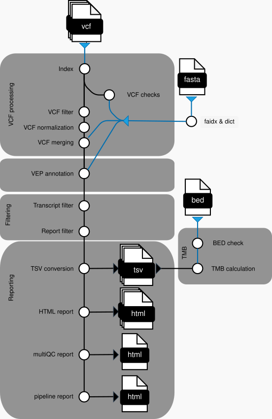

<h1>
  <picture>
    <source media="(prefers-color-scheme: dark)" srcset="docs/images/cio-abcd-variantinterpretation_logo_dark.png">
    
  </picture>
</h1>

[](https://doi.org/10.5281/zenodo.10036356)
[](https://github.com/cio-abcd/variantinterpretation/actions/workflows/nf-test.yml)
[](https://github.com/cio-abcd/variantinterpretation/actions/workflows/linting.yml)[](https://nf-co.re/variantinterpretation/results)[](https://doi.org/10.5281/zenodo.XXXXXXX)
[](https://www.nf-test.com)

[](https://www.nextflow.io/)
[](https://github.com/nf-core/tools/releases/tag/3.3.2)
[](https://docs.conda.io/en/latest/)
[](https://www.docker.com/)
[](https://sylabs.io/docs/)
[](https://cloud.seqera.io/launch?pipeline=https://github.com/cio-abcd/variantinterpretation)

## Introduction

<<<<<<< HEAD
<<<<<<< HEAD
=======
>>>>>>> 569e795 (Restored README)
The **variantinterpretation** pipeline is a bioinformatic analysis workflow adding biological and clinical knowledge to genomic variants.
It takes as input genomic variants in the variant calling file format (VCF), adds annotations and wraps them into an HTML report and spreadsheet-compatible TSV files.
Variants are annotated with information that support molecular biologists and pathologists in interpreting their functional relevance in a biological and clinical context.
Further, the pipeline enables variant filtering and deriving meaningful metrics as the tumor mutational burden (TMB).
<<<<<<< HEAD
=======
**cio-abcd/variantinterpretation** is a bioinformatics pipeline that ...
>>>>>>> ce0b66e (Changed name to cio-abcd)
=======
>>>>>>> 569e795 (Restored README)

The pipeline is currently tailored for analyzing somatic single-nucleotide variants (SNVs) and small Insertions and Deletions (InDels).
In principle, the workflow was designed to work with all VCF files independent from the originating variant caller.
We tested the pipeline with the variant callers mutect2 and freebayes and are happy to get feedback about compatibility or problems with other variant callers.

<<<<<<< HEAD
<<<<<<< HEAD
The pipeline is built using [Nextflow](https://www.nextflow.io), a workflow tool to run tasks across multiple compute infrastructures in a very portable manner. It uses Docker/Singularity containers making installation trivial and results highly reproducible. Further it provides many options for configuration the pipeline to tailor them to your specific application. The [Nextflow DSL2](https://www.nextflow.io/docs/latest/dsl2.html) implementation of this pipeline uses one container per process which makes it much easier to maintain and update software dependencies. Where possible, these processes have been submitted to and installed from [nf-core/modules](https://github.com/nf-core/modules) in order to make them available to all nf-core pipelines, and to everyone within the Nextflow community.
=======
<!-- TODO nf-core: Include a figure that guides the user through the major workflow steps. Many nf-core
     workflows use the "tube map" design for that. See https://nf-co.re/docs/guidelines/graphic_design/workflow_diagrams#examples for examples.   -->
<!-- TODO nf-core: Fill in short bullet-pointed list of the default steps in the pipeline -->1. Read QC ([`FastQC`](https://www.bioinformatics.babraham.ac.uk/projects/fastqc/))2. Present QC for raw reads ([`MultiQC`](http://multiqc.info/))
>>>>>>> 3fb0358 (Template update for nf-core/tools version 3.3.2)
=======
The pipeline is built using [Nextflow](https://www.nextflow.io), a workflow tool to run tasks across multiple compute infrastructures in a very portable manner. It uses Docker/Singularity containers making installation trivial and results highly reproducible. Further it provides many options for configuration the pipeline to tailor them to your specific application. The [Nextflow DSL2](https://www.nextflow.io/docs/latest/dsl2.html) implementation of this pipeline uses one container per process which makes it much easier to maintain and update software dependencies. Where possible, these processes have been submitted to and installed from [nf-core/modules](https://github.com/nf-core/modules) in order to make them available to all nf-core pipelines, and to everyone within the Nextflow community.
>>>>>>> 569e795 (Restored README)

<!-- TODO nf-core: Add full-sized test dataset and amend the paragraph below if applicable -->
<!-- On release, automated continuous integration tests run the pipeline on a full-sized dataset on the AWS cloud infrastructure. This ensures that the pipeline runs on AWS, has sensible resource allocation defaults set to run on real-world datasets, and permits the persistent storage of results to benchmark between pipeline releases and other analysis sources.-->

## Documentation

1. **Detailed description** about the modules, their function, capabilities, limitations and configuration tips can be found in the following chapters of this README.
2. A **Step-by-step guide** for setting up and running this workflow that is also suited for beginners with nextflow and nf-core pipelines can be found in the [docs/usage.md](docs/usage.md) documentation.
3. A **Output file description** from each module can be found in the [docs/output.md](docs/output.md) documentation.
4. A **parameter description** with all their defaults, possible values and help texts can be found on the [docs/params.md](docs/params.md) documentation.

## Pipeline overview



1. [VCF preprocessing](#vcf-preprocessing)
   - [Indexing](#vcf-indexing) with `bctools index`.
   - [VCF checks](#vcf-checks)
     - Checks samplesheet integrity with modified [nf-core script](bin/check_samplesheet.py)
     - Checks VCF file requirements and integrity with `GATK4 ValidateVariants`, `bcftools` and a custom python script.
     - Runs optional BED file format check using a [python script](bin/process_bedfiles.py)
   - [Pre-annotation VCF filtering](#pre-annotation-vcf-filter) based on FILTER column entries using `bcftools view`.
   - [VCF normalization](#vcf-normalization): Splitting of multi-allelic into bi-allelic variants and optional left-alignment of InDels using `bcftools norm`.
   - [VCF merging](#vcf-merging): Optional merging of VCF file based on 'group' column in samplesheet into multi-sample VCF files.
2. [Variant annotation](#ensembl-vep-annotation) using the ensembl variant effect predictor (VEP).
3. [Filtering](#filtering)
   - [Transcript filtering](#transcript-filtering) using the filter_vep script.
   - [Custom filters](#custom-filters): Create additional filtered VCF files based on preset filter criteria using `vembrane tag` and `vembrane filter`.
4. [Reporting](#reporting)
   - [TSV conversion](#tsv-conversion) based on VCF fields including FORMAT and INFO columns and the VEP annotation fields encoded as CSQ strings in the INFO field using `vembrane table`.
   - [HTML report](#html-report) generation using `datavzrd`.
   - [MultiQC HTML report](#multiqc) summarizing general statistics and warning messages.
   - [Pipeline information](#pipeline-information) summarizing runtime and other statistics in nf-core pipeline overview.
5. [Tumor mutational burden (TMB) calculation](#tumor-mutational-burden-tmb-calculation-module): Based on provided cutoffs and thresholds for each sample using the vembrane TSV output and a python script.

## Module description

### VCF preprocessing

#### VCF indexing

Creates tabix index (tbi) for the VCF file that is required for several workflow processes using [`bcftools index`](https://samtools.github.io/bcftools/bcftools.html#index).
It requires an uncompressed or bgzip compressed VCF file.

<<<<<<< HEAD
<<<<<<< HEAD
#### VCF checks
=======
```bash
nextflow run cio-abcd/variantinterpretation \
   -profile <docker/singularity/.../institute> \
   --input samplesheet.csv \
   --outdir <OUTDIR>
```
>>>>>>> ce0b66e (Changed name to cio-abcd)
=======
#### VCF checks
>>>>>>> 569e795 (Restored README)

This VCF quality control module checks for integrity of the VCF file and several requirements to the input variants. It additionally can create warnings logged in the multiQC module if the VCF file shows some characteristics that can hamper interpretation.

It uses the following tools:

- [GATK4 ValidateVariants](https://gatk.broadinstitute.org/hc/en-us/articles/360037057272-ValidateVariants)
- [bcftools stats](https://samtools.github.io/bcftools/bcftools.html#stats)
- custom python script

The following table gives an overview about the criteria that are checked and possible warnings:

| criteria                                     | log-level | description                                                                                                                                                                                                                                                                                 | tool                     |
| -------------------------------------------- | --------- | ------------------------------------------------------------------------------------------------------------------------------------------------------------------------------------------------------------------------------------------------------------------------------------------- | ------------------------ |
| VCF file format                              | ERROR     | General structure of VCF file needs to stick to the [VCF file format](https://samtools.github.io/hts-specs/).                                                                                                                                                                               | `GATK4 ValidateVariants` |
| uncompressed or bgzip compressed             | ERROR     | VCF files needs to be either uncompressed or bgzip compressed. Gzip-compressed files give an error during indexing.                                                                                                                                                                         | `bcftools index`         |
| "chr" prefix in CHROM column                 | ERROR     | The chromosome column `CHROM` in the VCF file needs to contains the "chr" prefix. Please be aware that the provided reference genome also contains the "chr" prefix. This ensures compatibility with annnotation sources.                                                                   | `python script`          |
| matching reference genome                    | ERROR     | Provided VCF file needs to match the provided reference genome. Especially this test can differentiate between GRCh37 and GRCh38 human reference genomes. If left-alignment of indels is activated, `bcftools norm` also additionally checks the reference genome.                          | `GATK4 ValidateVariants` |
| only passed filters                          | WARNING   | Gives warning if the FILTER column contains entries other than "PASS" or ".". NOTE: These can be removed with the the `filter_pass` parameter in the VCF preprocessing module. Also, new flags might be added after annotation if additional filters are specified in the Filtering module. | `python script`          |
| no-ALT entries                               | WARNING   | Gives warning if VCF file contains non-variant positions. Genomic VCF files (gVCFs) are supported in the pipeline but can dramatically increase the runtime of VEP.                                                                                                                         | `bcftools stats`         |
| no multiallelic sites                        | WARNING   | Gives warning if the VCF file contains multiallelic variants. NOTE: These will be automatically split with `bcftools norm` in the VCF preprocessing module.                                                                                                                                 | `bcftools stats`         |
| contains other variants than SNVs and InDels | WARNING   | Gives warning if VCF file contains other variants than SNVs and InDels.                                                                                                                                                                                                                     | `bcftools stats`         |
| previous VEP annotation present              | WARNING   | Gives warning if previous VEP annotation is present. The test checks for VEP in the header and if the INFO column already contains a `CSQ` key.                                                                                                                                             |

<<<<<<< HEAD
<<<<<<< HEAD
#### Pre-annotation VCF filter
=======
cio-abcd/variantinterpretation was originally written by CIO-ABCD.
>>>>>>> ce0b66e (Changed name to cio-abcd)
=======
#### Pre-annotation VCF filter
>>>>>>> 569e795 (Restored README)

It can filter VCF files based on flags in the FILTER column using [`bcftools view`](https://samtools.github.io/bcftools/bcftools.html#view).
This can be enabled with the `--filter_vcf` parameter providing flag names for the VCF FILTER column to be kept (e.g., "PASS").
This step is placed prior to annotation to improve runtime if, e.g., lots of low-quality variants are removed.

> WARNING: Variants filtered in this step will NOT be included in any output file!

#### VCF normalization

This module uses [`bcftools norm`](https://samtools.github.io/bcftools/bcftools.html#norm) to split multi-allelic into bi-allelic sites.
This step is required by vembrane as it cannot handle multi-allelic records (also see [vembrane documentation](https://github.com/vembrane/vembrane)).
Optionally, the left-alignment of InDels can be activated using the `--left-align-indels` parameter.

> NOTE: When left-alignment is enabled, it performs an additional reference genome check (there is already a check in the `VCF checks` module).

#### VCF Merging

This is an optional step activated with the `--merge_vcfs` parameter.
It requires an additional column in the `samplesheet.csv` named 'group' that specifies which VCF files to merge.
This column can consist of arbitrary name or number that will be used to name the respective output.
The module uses `bcftools merge` to create a multi-sample VCF file from the input VCF files. The sample names within the original VCFs will be preserved with an additional prefix that contains the samplename from the 'sample' column of the `samplesheet.csv`.

> NOTE: The order of VCF input files to `bcftools merge` is important for merging the VCF header.
> Hence, the order of VCF files within the samplesheet is preserved as input for `bcftools merge` to ensure reproducibility.
> If you encounter an pipeline error downstream hinting towards malformatted VCF header, you can try changing the order of VCF files.

### Ensembl VEP annotation

[Variant effect predictor (VEP)](https://www.ensembl.org/info/docs/tools/vep/index.html) annotates variants based on provided public databases. It provides biological information as protein consequence and effect prediction as well as co-located variants from existing databases, e.g., about population allele frequencies. For full overview, see the [VEP annotation sources](https://www.ensembl.org/info/docs/tools/vep/script/vep_cache.html) and [VEP command flags](https://www.ensembl.org/info/docs/tools/vep/script/vep_options.html).

Currently, this workflow only supports annotation with sources from the VEP cache.
We plan on adding other databases as annotation source in the future.
To add HGVS nomenclature for variants, you need to specify a FASTA file which is therefore a requirement for this pipeline.
You can easily enable/disable VEP options using several parameter, also see the parameter documentation [docs/params.md](docs/params.md).

The databases and their respective version is documentated within the VCF file under the VEP flag.
Currently, we use VEP version 113 and hence using the VEP cache from v113 is highly recommended. It contains the following databases:

- ensembl=113
- assembly="GRCh38.p14"
- MANE=v1.3
- gencode="47"
- refseq="GCF_000001405.40-RS_2023_10 (GCF_000001405.40_GRCh38.p14_genomic.gff)"
- regbuild="1.0"
- polyphen="2.2.3"
- sift="6.2.1"
- dbSNP="156"
- COSMIC="99"
- HGMD-PUBLIC="2020.4"
- ClinVar="2024-04"
- 1000genomes="phase3 (remapped)"
- gnomAD exomes="r4.1"
- gnomAD genomes="v4.1"

### Filtering

#### Transcript filtering

The first step after annotation is a (optional) filtering for transcripts using the [`filter_vep` script](https://www.ensembl.org/info/docs/tools/vep/script/vep_filter.html) provided by the VEP software suite.
VEP adds all possible transcripts and their annotations (e.g., consequence) to the variant records in the VCF file.
For interpretation it is useful to filter for the most relevant or very specific transcripts.

> NOTE: The final TSV and HTML reports include each transcript from a variant as a separate row!
> For example: If you have a variant with 6 transcripts annotated, this results in 6 separate rows in the final TSV file for each transcript from the same variant.

This module has a default external argument `--soft_filter` to prevent silent dropping of variants.
Instead a flag "filter_vep_fail/filter_vep_pass" will be added to the FILTER column.
Another default external argument is also `--only_matched` that will result in annotation being dropped if it does not match the filtering criteria.
This results in variants only having transcript annotations if matching the filter criteria, variants without any matching transcript will be retained, but without any annotation.

This module has two options to filter transcripts:

1. Filter by specific VEP annotation columns using the parameter `--transcriptfilter`. It only supports specific columns that provide a boolean information about which transcript to include:
   - PICK: Provided by VEP and recommended for extracting only the most relevant transcript. It uses an ordered set of criteria to identify those transcripts summarized in the [VEP documentation](https://www.ensembl.org/info/docs/tools/vep/script/vep_other.html#pick).
   - CANONICAL: Flag for canonical transcripts [defined by Ensembl](https://www.ensembl.org/info/genome/genebuild/canonical.html).
   - MANE_SELECT: [Matched annotation from NCBI and EBI](https://www.ensembl.org/info/genome/genebuild/mane.html).
2. Filter by a specific list of transcripts provided by the `--transcriptlist` parameter. Can be combined with `--transcriptfilter`. The provided file needs to contain one transcript per row and matches the provided VEP cache transcript definitions (Refseq or Ensembl), see also the downloads section in [docs/usage.md](docs/usage.md). Please note that the annotation will be completely removed for variants that do not match any of the provided transcripts!

> WARNING: Transcripts filtered in this step will not be shown in any output file!

#### Custom filters

This module can create additional reports in which preset filters are applied.
These are very useful for interpretation as you can once define complex filters and do not have to enter these manually in your spreadsheet program or HTML report every single time.
It can be used, e.g., for hopper-based interpretation strategies.
[`vembrane`](https://github.com/vembrane/vembrane) is used for creating filtered subsets of the VCF files from which additional TSV files and HTML reports will be created.
The workflow always creates a report for the VCF file after transcript filtering.
It can be configured as following:

1. Define your preset filters in a TSV file and supply it with the `--custom_filters` parameter. You can find an example TSV file in the assets folder: [assets/custom_filters.tsv](assets/custom_filters.tsv).
   The TSV files needs two columns: The first column contains the name of the filter (letters, numbers and underscores allowed), the second column a valid python expression defining the filter. The python expression has to follow the guidelines for vembrane, also see here: [https://github.com/vembrane/vembrane#filter-expression](https://github.com/vembrane/vembrane#filter-expression).
2. Define the filters to be used in this run with `--used_filters`. This allows you to define a multitude of filters in a central TSV file, but only use a subset of them for specific runs.

The module performs two consecutive steps for filtering the variants:

1. Tag variants in their FILTER columns using [`vembrane tag`](https://github.com/vembrane/vembrane#vembrane-tag) with the respective filter name. This tag can be found in every report file.
2. Create additional VCF files by filtering for each of the `--used_filters` specified using [`vembrane filter`](https://github.com/vembrane/vembrane#vembrane-filter).

### Reporting

Summary of final output files in `reports/` folder:

1. [TSV files](#tsv-conversion) for each sample and preset filter in `tsv/`
2. [HTML reports](#html-report) for each sample and preset filter in `html/`
3. [MultiQC report](#multiqc) in `multiQC`
4. Nextflow pipeline report in `pipeline_report/`

#### TSV conversion

The VCF file is converted into a tab-separated values (TSV) file format using [`vembrane table`](https://github.com/vembrane/vembrane#vembrane-table).
This can be easily imported into spreadsheet programs for manual processing.
Several parameters can control which VCF fields are extracted into the TSV file.
Note that the resulting TSV file is the basis for HTML reports, hence the HTML report will not contain fields missing in the TSV file.
The following parameters control the extracted TSV fields:

- `format_fields` and `--info_fields`: Extract specific fields from INFO and FORMAT column as separate columns in the TSV output, e.g., DP in the FORMAT column. It can also handle mathematical operations, e.g. `AD[1] / DP` will divide allelic depth by read depth.
- `--annotation_fields`: These extract CSQ strings of the FORMAT column added by VEP annotation. the value `all` results into extraction of all available fields (default).
- `--allele_fraction`: Define how to extract the allele fraction from the VCF file.
  Variant callers save this information in different ways, the allele fraction defined here will be used for downstream operations, e.g., filtering and TMB calculation. It will be extracted into the column named `allele_fraction`. This will be done for each sample separately in the VCF file.
  You can find more information about available options in the [parameter help text](docs/params.md). If your option is not supported, please let us know!
- `--read_depth`: Similar to allele fraction for the read depth. Specifies the FORMAT fields containing read depth information, which will be extracted into the `read_depth` column and used downstream. Also done for each sample in the VCF file.

For an overview of CSQ fields included in the VEP-annotated VCF file, have a look into the [VEP output documentation](https://www.ensembl.org/info/docs/tools/vep/vep_formats.html#output).

#### HTML report

HTML reports are generated using [datavzrd](https://github.com/datavzrd/datavzrd#readme) based on a YAML configuration file.
The HTML report enables several features including interactive filtering, links within the data or to the internet, plotting, etc.
The configuration file is rendered using the [YTE template engine](https://github.com/yte-template-engine/yte#readme) that enables usage of python code in YAML files for dynamic rendering.
The HTML report can be highly customized by defining the structure and display of each column with the `--annotation_colinfo` parameter.
You can find detailed information in the [parameters help text](docs/params.md). By default, the preconfigured columns in [assets/annotation_colinfo.tsv](assets/annotation_colinfo.tsv) are used.
The pipeline allows the report to distribute columns to different HTML sites using the `group` identifier making the report more clear and easy to read.
You can further define the displayed column name, if the column should be shown by default and create special visualizations, e.g. tick plots, heatmaps and hyperlinks, by defining the `data_type` of each column.
Each HTML report also contains a button to export an excel file (`.xlsx` format), which differs from the TSV file, e.g., by grouping columns in different sheets based on their `group` definition.

If you are familiar with datavzrd config files, you can also specify your own datavzrd configuration template using the `--datavzrd_config parameter` and customize the HTML report even more. By default, the configuration file in [assets/datavzrd_config_template.yaml](assets/datavzrd_config_template.yaml) is used and rendered.

#### MultiQC

[MultiQC](http://multiqc.info) is a visualization tool that generates a single HTML report summarising all samples in your project.
Most of the pipeline QC results are visualised in the report and further statistics are available in the report data directory.
Results generated by MultiQC collate pipeline QC from supported tools e.g. bcftools.
The pipeline has special steps which also allow the software versions to be reported in the MultiQC output for future traceability.
For more information about how to use MultiQC reports, see <http://multiqc.info>.

It can have the following sections:

- Warnings: Collects warnings from the VCF check modules that might have an influence on the results.
- bcftools: Summarized statistics from `bcftools stats` command giving an overview about variant types, quality, depth and InDel distribution.
- VEP: Gives a detailed report and visualizations about VEP annotation results for all variants of each sample.
- Description of variantinterpretation pipeline.

#### Pipeline information

[Nextflow](https://www.nextflow.io/docs/latest/tracing.html) provides excellent functionality for generating various reports relevant to the running and execution of the pipeline. This will allow you to troubleshoot errors with the running of the pipeline, and also provide you with other information such as launch commands, run times and resource usage.

### Tumor Mutational Burden (TMB) calculation module

The TMB calculation module calculates the ratio of eligible mutations per Megabasepair (MBp) using a custom [python scripts](bin/calculate_TMB.py).
The TMB module works in coordination with the BED check module, as a BED file is required to calculate the panelsize-adapted TMB, and requires a set of filtering thresholds which define the eligibility of a mutation.
The eligible mutations remaining after each applied filtering step (variant type, coverage, allele frequency, population allele frequency) and the panel size (in bp) inferred from the provided BED file are reported.
The calculation will be performed on the vembrane TSV output file, allowing for prefiltering of unwanted mutations using the variant-filter step prior to TMB calculation.
TMB calculation will only be performed if a [well-formatted BED file](https://genome.ucsc.edu/FAQ/FAQformat.html#format1) was provided to the workflow.
Based on the provided BED file, a comparison to the provided breaking threshold (`--panelsize_threshold`) will be performed.
If the BED file covers less base pairs than the provided threshold, calculation will be stopped and a warning raised.
TMB calculation is not a unified and standarized process, thus different filtering thresholds can be provided including a variant type filter for SNVs or SNVs and MNVs, lower and upper allele frequency boundaries, a minimal threshold for coverage, a maximal threshold for presence in the [gnomAD global population frequency](https://gnomad.broadinstitute.org/) or another defined population database and a flag to filter InDels from the calculation procedure.

The main parameter flags and their respective defaults are:

- `--calculate_tmb` : boolean, activates the TMB calculation module. [default: false]
- `--min_af` : float, defines the lower allele frequency (AF) filtering threshold, dropping all mutations with an AF below the value. [default: 0.00]
- `--max_af` : float, defines the upper AF filtering threshold, dropping all mutations with an AF above the value. [default: 1.00]
- `--min_cov` : integer, defines the lower coverage threshold based on the reported DP value of the vembrane tsv, dropping all mutations below the threshold. Consider increasing the value for highly-covered data (e.g. Panel-derived data) to reduce technical artifacts [default: 10]
- `--filter_muttype` : string, defines the filtering stringency for non single nucleotide variants, as f.e. multinucleotide variants or InDels. Setting **'snv'** will only consider single-base substitutions as eligible, **'mnv'** will additionally consider double-base substitutions and other substitution classes, every other string input will retain the full dataset as eligible. [default: 'snv']
- `--population_db` : string, defines the major population database following the [VEP output nomenclature for external databases](https://www.ensembl.org/info/docs/tools/vep/vep_formats.html#output) for population AF based filtering. If not changed, it defaults to the combined global gnomAD exome AF as filtering database. The string should be formatted as 'CSQ\_{population_database_name}' to be compatible with the vembrane TSV output. [default: 'CSQ_gnomADe_AF']
- `--panelsize_threshold` : integer, defines an additional threshold which checks if the provided BED file covers more basepairs than the threshold value. The TMB module will skip the TMB calculation without breaking the pipeline if the panelsize is below the threshold. The threshold should be lowered if the provided BED file covers less than 1 MBp but a TMB estimate needs to be inferred. [default: 1000000]
- `--filter_roi_for_tmb`: boolean, controls if the TMB value should be calculated only on the provided positional arguments from the provided BED file. This option affects only the TMB calculation and would be equivalent of running the workflow with both `--tag_roi` and `--filter_vcf '"PASS"'`. [default: false]
- `--filter_consequence`: boolean, controls if consequence filtering should be performed. Should be used in conjuction with `--csq_values` or no filtering based on consequences will be performed. [default: false]
- `--csq_values`: comma-seperated string containing [consequences as defined on the VEP website](https://www.ensembl.org/info/genome/variation/prediction/predicted_data.html) fo which consequence filtering should be performed. If not defined it will default to all consequences retaining all mutations. [default: null]

## Contributions and Support

This Pipeline development repository is a collaborative effort of the center for integrated oncology (CIO) of the universities of Aachen, Bonn, Cologne and Düsseldorf (ABCD) to standardize and optimize data analysis in a clinical context.

<!-- TODO: Add Information on CIO and ZPM -->

If you would like to contribute to this pipeline, please see the [contributing guidelines](.github/CONTRIBUTING.md).

**Contributing authors**

- RWTH University Hospital (UKA): Lancelot Seillier
- University Hospital Bonn (UKB): Patrick Basitta, Florian Hölscher
- University Hospital Köln (UKK): tba
- University Hospital Düsseldorf (UKD): Kai Horny

## Citations

<<<<<<< HEAD
<<<<<<< HEAD
If you use variantinterpretation for your analysis, please cite it using the following doi: [10.5281/zenodo.10036356](https://doi.org/10.5281/zenodo.10036356)
=======
<!-- TODO nf-core: Add citation for pipeline after first release. Uncomment lines below and update Zenodo doi and badge at the top of this file. -->
<!-- If you use cio-abcd/variantinterpretation for your analysis, please cite it using the following doi: [10.5281/zenodo.XXXXXX](https://doi.org/10.5281/zenodo.XXXXXX) -->

<!-- TODO nf-core: Add bibliography of tools and data used in your pipeline -->

>>>>>>> ce0b66e (Changed name to cio-abcd)
=======
If you use variantinterpretation for your analysis, please cite it using the following doi: [10.5281/zenodo.10036356](https://doi.org/10.5281/zenodo.10036356)
>>>>>>> 569e795 (Restored README)
An extensive list of references for the tools used by the pipeline can be found in the [`CITATIONS.md`](CITATIONS.md) file.

You can cite the `nf-core` publication as follows:

> **The nf-core framework for community-curated bioinformatics pipelines.**
>
> Philip Ewels, Alexander Peltzer, Sven Fillinger, Harshil Patel, Johannes Alneberg, Andreas Wilm, Maxime Ulysse Garcia, Paolo Di Tommaso & Sven Nahnsen.
>
> _Nat Biotechnol._ 2020 Feb 13. doi: [10.1038/s41587-020-0439-x](https://dx.doi.org/10.1038/s41587-020-0439-x).
